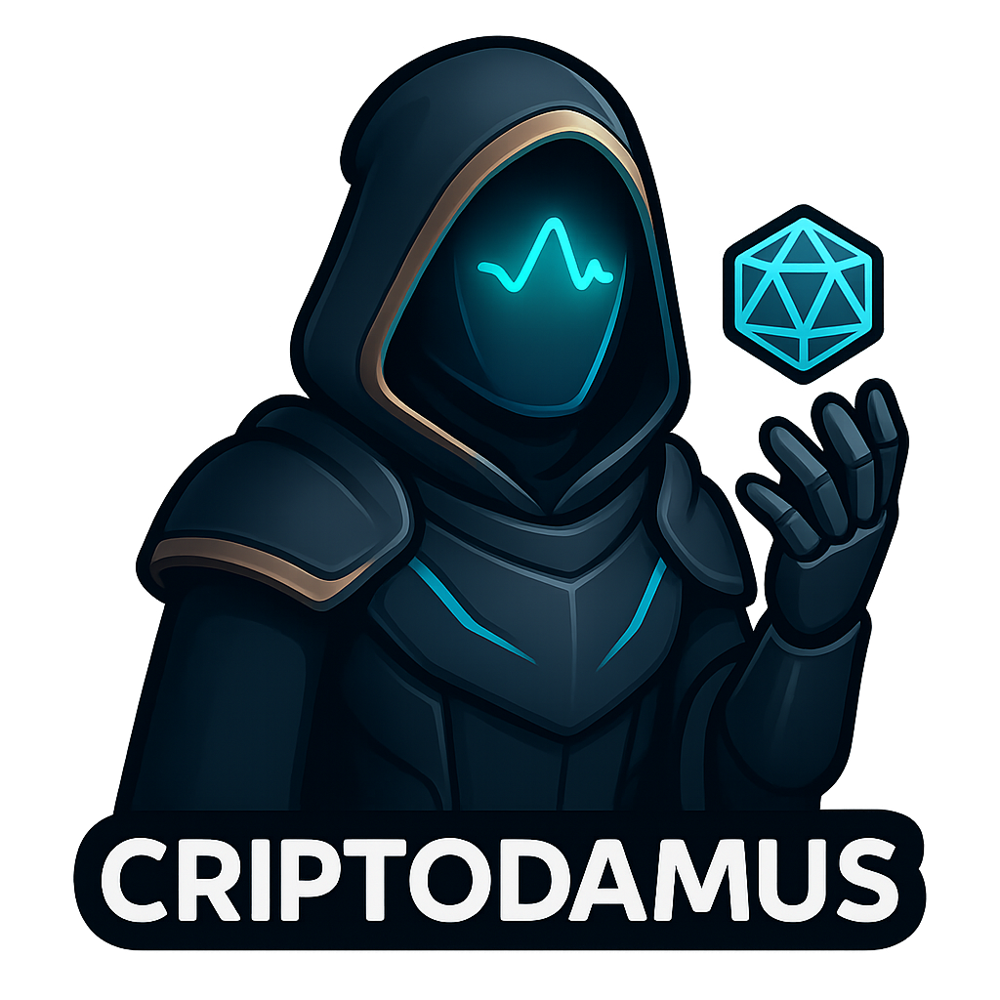

# 🚀 Criptodamus v4.0: Sistema Autónomo de Análisis de Mercado Institucional

**Slogan:** "La democratización de la inteligencia institucional. Preservación de capital primero, captura de Alpha después."

## 1. Resumen Ejecutivo (The Hook)
Criptodamus no es otro "bot de trading" más. Es un **Sistema de Soporte a la Decisión (DSS)** de grado institucional diseñado para automatizar el flujo de trabajo analítico de un trader cuantitativo senior.

Mientras que las herramientas retail tradicionales dependen de indicadores rezagados (como un RSI básico o MACD), Criptodamus utiliza un **Motor Fractal Multicapa** impulsado por IA para identificar regímenes de mercado de alta probabilidad en tiempo real. Resolvemos el problema principal del trader retail: la falta de disciplina y la incapacidad de procesar múltiples variables correlacionadas simultáneamente.

## 2. El Problema y La Solución

*   **El Problema:** El 90% de los traders retail pierden dinero porque operan con emociones, ignoran el contexto macroeconómico y utilizan herramientas simplistas que no funcionan en mercados correlacionados.
*   **La Solución Criptodamus:** Una plataforma que actúa como un "Cerebro Quant" externo. No solo dice *dónde* entrar, sino que explica *por qué*, validando cada señal a través de múltiples marcos temporales y ajustando el riesgo dinámicamente según la volatilidad y la sesión de mercado.

## 3. Tecnología Propietaria ("The Secret Sauce")

Nuestro stack tecnológico se diferencia por su arquitectura modular de **Servicios Expertos**:

### A. Detector de Régimen de Mercado ("The Weatherman")
El sistema no fuerza operaciones. Primero identifica las "condiciones climáticas" del mercado:
*   **Tendencia:** Busca continuaciones y retrocesos.
*   **Rango:** Opera extremos (reversión a la media).
*   **Volatilidad:** Identifica expansiones desde compresiones (Squeezes).
*   **Extremo:** Caza agotamientos estadísticos (Z-Score > 3σ).

### B. Validador Fractal ("God Mode Protocol")
Nuestra ventaja competitiva. Una señal solo es válida si se alinea matemáticamente en tres dimensiones temporales:
1.  **Macro (1W/1D):** Establece la dirección del flujo dominante ("El Río").
2.  **Estructural (4H):** Identifica niveles clave de Soporte/Resistencia.
3.  **Táctico (15m/1H):** Ejecuta la entrada precisa.
*Resultado:* El modo **"God Mode"** solo se activa cuando estas tres capas convergen perfectamente.

### C. Gestión de Riesgo Institucional ("The Shield")
Implementamos defensas que los bots retail ignoran:
*   **Filtro de Correlación Dinámica:** Si Bitcoin (el índice del mercado) muestra debilidad estructural, el sistema bloquea automáticamente todas las señales de compra (Longs) en altcoins, previniendo pérdidas catastróficas.
*   **Normalización de Volatilidad (ATR):** El tamaño de la posición y los Stop Loss se ajustan automáticamente según la volatilidad real del activo, no por porcentajes fijos arbitrarios.

### D. Asesor Autónomo Explicable (XAI)
Rompemos la "Caja Negra". Cada señal viene acompañada de una tesis generada por IA que explica la lógica del trade (ej. "Entrada por Divergencia RSI + Testeo de Fair Value Gap"), educando al usuario mientras opera.

## 4. Modelo de Negocio y Escalabilidad

Tenemos una hoja de ruta clara para evolucionar de un MVP a una plataforma SaaS global:

*   **Fase Actual (Tracción):** Modelo **"Donationware" / Freemium**. Eliminamos barreras de entrada para maximizar la adopción y crear una comunidad viral.
*   **Fase de Crecimiento (SaaS):** Suscripciones escalonadas (Basic/Pro/Institutional) que desbloquean características avanzadas como backtesting, señales en tiempo real vía WebSocket y acceso a la API.
*   **Escalabilidad Técnica:** Arquitectura lista para la nube (Microservicios, Redis para caché, PostgreSQL) diseñada para soportar 10,000+ usuarios concurrentes con latencia mínima.

## 5. Visión a Futuro
Nuestro objetivo es convertirnos en el **"Bloomberg de las Criptomonedas para Retail"**. Empezamos con el análisis técnico automatizado, pero la infraestructura está lista para integrar análisis de sentimiento social y métricas on-chain, creando el ecosistema de inteligencia financiera más robusto para el inversor individual.
